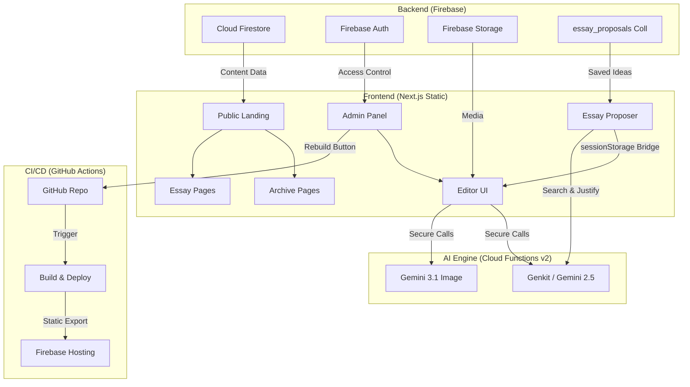

# 📐 Master Project Blueprint: Bauhausian Editorial Platform
*Version 4.5 - February 27, 2026*

This is the **Ultimate Source of Truth** for the Bauhausian platform. It is designed to be a comprehensive "dummies guide" for developers and administrators, ensuring anyone can replicate, maintain, or expand this architecture from scratch.

---

## 🏛️ 1. Concept & Vision
**Bauhausian** is a sophisticated editorial platform where architecture, design, and critique intersect. It combines a minimalist, "Bauhaus-styled" aesthetic with state-of-the-art AI capabilities.

- **High Performance**: 100% static delivery via CDN.
- **AI-Enhanced**: Built-in intelligence for translation, content generation, and editorial proposals.
- **Archive-First**: A deep repository of historical architectural data that fuels contemporary creation.
- **Interactive Proposals**: Users can prompt the AI to justify specific topics using existing archive nodes.

---

## 🏗️ 2. Technical Architecture

The platform uses a **Hybrid Cloud Architecture** to solve the "Static vs Dynamic" paradox.



---

## 📋 3. Data Model & Schema (Firestore)

Understanding the data structure is vital for anyone managing the database manually or extending it.

### A. `archives` Collection
Historical research nodes.
- `type`: "core", "context", "bridge", "critical"
- `status`: "draft", "published", "scheduled"
- `themes`: Array of Theme IDs.
- `series`: Array of Series IDs.
- `translations`: Map of languages (`en`, `es`, etc.)
    - `title`, `slug`, `coreIdea`, `body` (HTML), `baseMaterial` (Array).
- `coverImage`: Storage URL (Optional).

### B. `essays` Collection
Contemporary critiques.
- `status`: "draft", "published", "scheduled"
- `themes`: Array of Theme IDs.
- `series`: Array of Series IDs (New in 4.5).
- `relatedArchiveIds`: Array of Archive IDs (Connecting nodes).
- `translations`: Map
    - `title`, `slug`, `essayFocus`, `body` (HTML).
    - `seo`: `{ metaTitle, metaDescription, keywords: { primary, secondary, longTail } }`
- `coverImage`: Storage URL (Optional).

### C. `essay_proposals` Collection (Saved Ideas)
- `prompt`: The user's original topic request.
- `title`: AI-suggested title.
- `pitch`: AI justification.
- `themeIds`: Relevant themes.
- `seriesId`: Associated series.
- `relatedArchiveIds`: Historical nodes used for justification.
- `isUserRequested`: Whether it was generated from a specific user prompt.

---

## 🚀 4. Setup Guide (For Dummies)

Follow these steps exactly to recreate the environment.

### A. Firebase Setup
1.  Create a project in the [Firebase Console](https://console.firebase.google.com/).
2.  **Enable Firestore**: In "Test Mode" initially, then apply production rules.
3.  **Enable Storage**: Set up a bucket for image uploads.
4.  **Enable Auth**: Activate "Email/Password" login.
5.  **Set Region**: Use `us-central1` for Functions and Firestore for best AI latency.

### B. Local Environment
Create a `.env.local` in the root (never commit this!):
```env
# Get these from Project Settings -> Apps -> Web App (Config)
NEXT_PUBLIC_FIREBASE_API_KEY=xxx
NEXT_PUBLIC_FIREBASE_AUTH_DOMAIN=xxx
NEXT_PUBLIC_FIREBASE_PROJECT_ID=xxx
NEXT_PUBLIC_FIREBASE_STORAGE_BUCKET=xxx
NEXT_PUBLIC_FIREBASE_MESSAGING_SENDER_ID=xxx
NEXT_PUBLIC_FIREBASE_APP_ID=xxx
```

### C. GitHub Secrets
For the automated deployment to work, add these 7 secrets to your repo settings (`Settings -> Secrets and variables -> Actions`):
- `FIREBASE_API_KEY`
- `FIREBASE_AUTH_DOMAIN`
- `FIREBASE_PROJECT_ID`
- `FIREBASE_STORAGE_BUCKET`
- `FIREBASE_MESSAGING_SENDER_ID`
- `FIREBASE_APP_ID`
- `FIREBASE_SERVICE_ACCOUNT` (Get this from: `Project Settings -> Service Accounts -> Generate new private key`. Paste the entire JSON string).

---

## 🤖 5. The AI Engine (Cloud Functions)

Located in `/functions`, this is where the intelligence lives. We use **Google Genkit** for orchestration.

### 🔑 Secret Management (The "Secured Brain")
To avoid leaking keys, we use Google Secret Manager.
- Run: `firebase functions:secrets:set GEMINI_API_KEY`
- Run: `firebase functions:secrets:set GITHUB_PAT` (Personal Access Token from GitHub).

### 🛠️ The "Lazy-Load" Pattern (Critical!)
Genkit is a heavy dependency. To prevent Cloud Functions from timing out during the "discovery" phase, always load the AI SDK **inside** the function execution:

```typescript
// Correct way to load AI in functions/src/index.ts
let aiInstance: any = null;
const getAI = async () => {
    if (aiInstance) return aiInstance;
    const { genkit } = await import("genkit");
    const { googleAI } = await import("@genkit-ai/google-genai");
    aiInstance = genkit({
        plugins: [googleAI({ apiKey: process.env.GEMINI_API_KEY })],
    });
    return aiInstance;
};
```

### 🧠 AI Differentiating Logic (Essays vs. Archives)
The core differentiator of Bauhausian v4.6 is how the AI handles different content types.

| Feature | **Archive Entry** | **Essay / Critical Critique** |
| :--- | :--- | :--- |
| **Length** | Concise (2-3 paragraphs). | Extensive (6-10+ paragraphs). |
| **Tone** | Factual, objective, archival. | Provocative, analytical, intellectual. |
| **Sources** | 1-2 primary sources. | 4-5 diverse citations & references. |
| **Structure** | Linear and descriptive. | Complex narrative with `<h2>` & `<h3>` subheadings. |

---

## 🎨 6. Editorial Features

### 🖼️ AI Image ("Nano Banana" Flow)
The `generateImage` function uses `gemini-3.1-flash-image-preview`. It takes a prompt and returns a high-res base64 image.
- **Pattern**: Prompt → Gemini (Compute) → Client Preview → Upload to Storage.

### 💡 Interactive Essay Proposals
A bridge between archival history and contemporary creation.
- **Workflow**: 
    1. User enters a topic (e.g., "Minimalist social housing").
    2. AI justifies the topic using 2-3 specific nodes from the Archive.
    3. User can "Save" the proposal for later (stored in Firestore).
    4. "Start Draft" triggers a `sessionStorage` transfer.
- **Technical Bridge**: We serialize the draft to `sessionStorage.setItem('ai_essay_draft', ...)` and the `EssayEditor` picks it up upon mount.

### ✔️ "Bauhausian Check" (Proofreader & Tone)
The AI Proofreader in the `RichTextEditor` is not a simple spell-checker. It is an **Editorial Auditor**.
- **Mode: Archive**: Focuses on brevity and factual clarity.
- **Mode: Essay**: Focuses on "Sophisticaton & Depth." It ensures the narrative is intellectually rigorous.
- **Rules**: Audit tags, remove redundancy, elevate vocabulary without losing the "Minimalist" core.

---

## 🛡️ 7. Security Rules (Firestore & Storage)

Safety first. Our rules ensure the public can read content but only logged-in administrators can modify it.

### Firestore Rules Summary
- **Public Read**: Anyone can read categories like `/essays`, `/archive`, `/themes`.
- **Admin Write**: Only `isAuthenticated()` users can execute `create`, `update`, or `delete`.
- **System Lock**: Crucial collections like `/users` are locked.

---

## 🧩 8. Key UI Components (Admin Panel)

| Component | Path | Functionality |
| :--- | :--- | :--- |
| **EssayEditor** | `src/components/admin/EssayEditor.tsx` | Main editor with language toggles, SEO generation, and AI pre-filling. |
| **EssayProposer** | `src/components/admin/EssayProposer.tsx` | Dashboard for saved ideas and new AI justifications. |
| **RichTextEditor** | `src/components/admin/RichTextEditor.tsx` | Tiptap-based editor with AI Proofreader integration. |

---

## 🌊 9. Deployment & CI/CD Pipeline

We use a **Double Deployment** strategy.

### Step 1: Push to Main
Every commit to `main` triggers the GitHub Action (`.github/workflows/deploy.yml`). It performs a fresh `npm run build` (Static Export) and pushes the `out/` folder to Firebase Hosting.

### Step 2: The "Magic" Rebuild Button
Since the site is static, new database content won't appear until a rebuild.
- **Button**: "🚀 Rebuild Web" (Admin Sidebar).
- **Process**: Triggers the `triggerRebuild` Cloud Function, which tells GitHub Actions to start the deployment workflow via API.

---

## 🔧 10. Troubleshooting Encyclopedia

| Problem | Likely Cause | Solution |
| :--- | :--- | :--- |
| **Changes not visible** | CDN Caching | Perform a **Hard Refresh** (Ctrl + Shift + R). |
| **AI Content too short** | Wrong `targetType` | Ensure `targetType="essay"` is passed to the editor. |
| **Rebuild fails** | `GITHUB_PAT` expired | Generate a new token in GitHub and update Firebase secrets. |

---

## �️ 10. Media Engine & Image Studio
- **Auto-Optimization**: All images are optionally converted to `.webp` client-side before upload to reduce weight by up to 80% without visible quality loss.
- **Image Studio**: Integrated editor within the Media Picker using `react-easy-crop`.
    - **Presets**: 1:1 (Square), 16:9 (Wide), 4:5 (Portrait), 3:2 (Bauhaus).
    - **Visual Check**: Shows original vs. optimized file size in the library.
- **Retrospective Optimization**: You can edit already uploaded images to crop or re-compress them. The old version is automatically replaced by the new optimized one.
- **Lazy Loading**: Automatic integration of `loading="lazy"` for all library images to ensure high performance grades.

---


## �📐 11. Coding for Dummies: Common Snippets

### How to trigger a transition from Proposal to Draft?
```typescript
// Inside EssayProposer.tsx
const handleUseProposal = (proposal) => {
    // 1. Pack data
    const draft = { title: proposal.title, seed: proposal.pitch, relatedArchiveIds: proposal.ids };
    // 2. Transmit via session
    sessionStorage.setItem("ai_essay_draft", JSON.stringify(draft));
    // 3. Move to Editor
    router.push("/admin/essays/editor?fromAI=true");
};
```

### How to call an AI Flow from the Frontend?
```typescript
// Inside translate-client.ts
const generateFn = httpsCallable(functions, "generateFromSeed");
const result = await generateFn({ seedContent: "...", targetType: "essay" });
return result.data;
```

---
*Reference: Documentation maintained by Antigravity AI*
*Last Update: Feb 27, 2026 - Bauhausian v4.6 (AI Essay Focus)*
